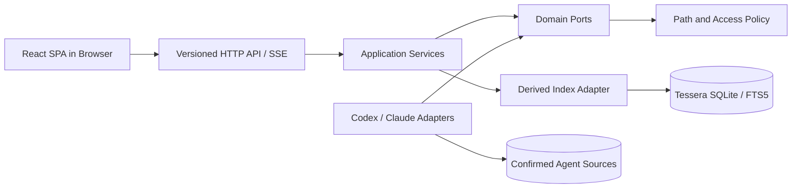
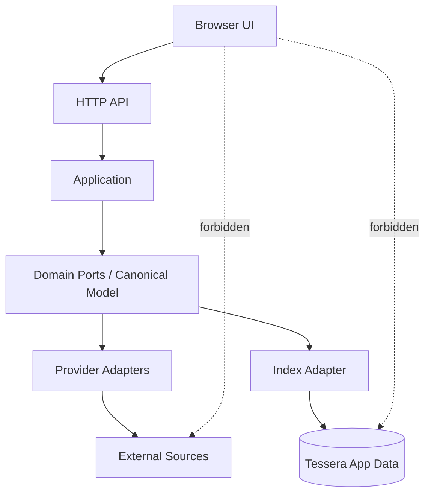
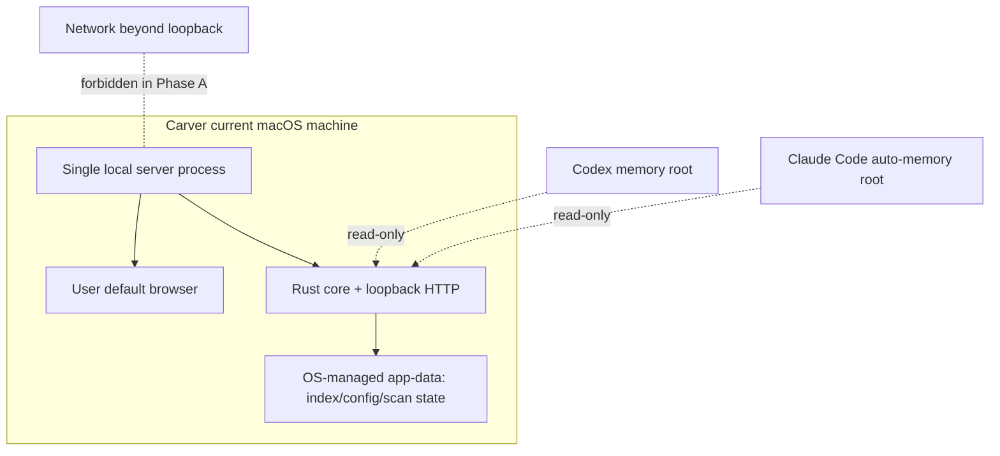
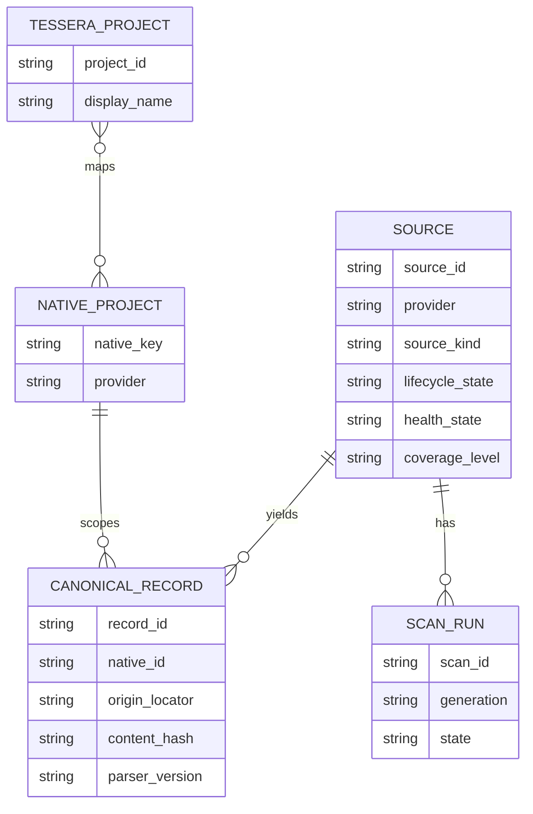

# Architecture Spine — Tessera MVP

## Design Paradigm

采用 **local-first hexagonal modular monolith**：原始 Agent Memory 留在用户确认的本机 Source，Tessera 只生成自己的 Derived Index；Rust core 是唯一业务与文件访问边界，Provider 以 Adapter 形式接入，React UI（浏览器 SPA）通过 loopback-only HTTP API 使用端口。

> 2026-07-22 交付形态变更：弃用 Tauri 桌面壳，改为本地 Web 应用——Rust core 内嵌 HTTP 服务，系统浏览器承载 UI。浏览器客户端成为真实需求，激活原 Deferred 的 local-HTTP 项（见 AD-9 与 sprint-change-proposal-2026-07-22）。

依赖方向固定为：



UI 不直接依赖 Provider、文件系统或 SQLite。Adapter 不依赖 UI。只有 Application Services 可以协调 Source Registry、扫描、解析、索引和查询。

## Invariants & Rules

### AD-1 — [ADOPTED] Rust core owns the application boundary

- **Binds:** all; FR-1..FR-18, NFR-5..NFR-7
- **Prevents:** 各功能切片自行读取文件、执行 SQL 或暴露新的网络服务。
- **Rule:** 所有文件访问、Provider 解析、索引写入、项目映射和查询协调必须经过 Rust core 的 application service；UI 只能调用已登记的版本化 HTTP endpoint。

### AD-2 — [ADOPTED] Source owns truth; Tessera owns only a projection

- **Binds:** FR-6..FR-8, FR-15, NFR-1, NFR-9, NFR-10
- **Prevents:** Derived Index 成为第二事实源，或索引更新反向修改 Agent Memory。
- **Rule:** Codex/Claude 原生文件或 Provider 是唯一事实源；Tessera SQLite、Source Registry 状态和项目映射属于 Tessera 自有数据，可删除、可重建，禁止回写 Source。

### AD-3 — [ADOPTED] Provider access is capability-declared

- **Binds:** FR-1..FR-5, FR-9..FR-14, future connectors
- **Prevents:** search-only 结果被伪装成完整枚举，或不同 Adapter 对“已连接”的含义不一致。
- **Rule:** 每个 Adapter 必须声明 `discover`、`enumerate`、`search`、`watch`、`stable_native_ids` 和 `coverage_level`；核心只根据声明启用行为，UI 必须显示 `full | search_only | existence_only | unsupported`。合约固定在 `server/src/domain/ports/provider_adapter.rs`，测试夹具固定在 `server/tests/fixtures/providers/{codex,claude_code}`。

### AD-4 — [ADOPTED] Confirmed Source is the only readable boundary

- **Binds:** FR-1, FR-2, FR-6..FR-8, FR-18, NFR-5..NFR-7
- **Prevents:** 未确认路径被扫描、symlink/path traversal 逃逸、UI 获得任意文件能力。
- **Rule:** discover 只产出 Candidate Source 元数据；确认后由 core canonicalize 并保存 allowlisted root；后续命令只接受 `source_id`/`record_id`，不接受任意路径、SQL 或文件句柄；每次读取重新校验目标仍在 root 内。

### AD-5 — [ADOPTED] One owner and one generation transition per Source

- **Binds:** FR-7, FR-8, FR-13..FR-15, NFR-8..NFR-10
- **Prevents:** 并发扫描覆盖、半套索引、删除判断与增量更新互相冲突。
- **Rule:** 每个 Source 由单一 Scan/Reconcile owner 排队处理；扫描先写 staging generation，只有完整成功才在一次事务中切换 active generation；失败继续暴露上一成功 generation。`scan_runs` 持久化 `queued/running/staging/committing/succeeded/failed/retry`，进程启动时回收 stale run。

### AD-6 — [ADOPTED] Canonical records preserve provenance and native identity

- **Binds:** FR-4, FR-5, FR-9..FR-12, FR-16..FR-17, SM-3
- **Prevents:** 跨 Provider 结果无法定位、项目映射覆盖原始身份、内容变化导致无法解释的记录漂移。
- **Rule:** Canonical Memory Record 必须保留 `record_id`、`source_id`、`provider`、`native_id/scope`、`origin_locator`、`source_revision/hash`、`parser_version`、`coverage_level` 和 `observed_at`；Tessera Project 只能作为额外映射，不能替换 native identity。record 粒度由 Adapter 声明为一个 source-native memory unit；`parser_version` 变化触发重解析但不改变同一 native locator 的身份。

### AD-7 — [ADOPTED] Lifecycle, health, coverage, and indexing state are separate

- **Binds:** FR-3, FR-13, FR-14, NFR-8, empty/error states
- **Prevents:** 用户把“已停用”“权限失败”“格式不支持”“没有结果”和“尚未扫描”混成同一种状态。
- **Rule:** Source lifecycle、Source Health、Coverage Level、scan state 和 active generation 分开建模；UI 使用结构化状态和错误 code 展示原因，不用布尔 `connected` 代替它们。

### AD-8 — [ADOPTED] Watchers are hints; reconcile is truth

- **Binds:** FR-8, FR-13..FR-15, NFR-9
- **Prevents:** 文件系统事件丢失、乱序或原子替换导致索引永久不一致。
- **Rule:** watcher 只产生按 Source debounce 的 dirty hint；reconcile 通过受限扫描、size/mtime/hash 和 parser version 判断变化；定期 reconcile 修复漏事件；事件本身不得直接增删 canonical records。

### AD-9 — [REVISED 2026-07-22] MVP transport is loopback-only HTTP served by the Rust core

- **Binds:** FR-18, NFR-2, NFR-5..NFR-7
- **Prevents:** 单机 MVP 暴露外部网络监听面、遭受 DNS rebinding / 跨站调用、或引入多客户端一致性问题。
- **Rule:** 交付形态为本地 Web 应用：Rust core 内嵌 HTTP 服务，UI 为系统浏览器中的 React SPA。请求—响应使用带 `api_version` 的版本化 JSON API；查询统一 `cursor + limit`（server-side bound）；低频状态用普通响应；扫描进度使用 SSE（`text/event-stream`，递增 sequence）并支持 cancellation token。服务**必须**仅绑定 `127.0.0.1`、校验 Host/Origin 以防 DNS rebinding 与跨站调用、响应携带收紧的 CSP 头；不监听任何外部网络接口，不开放 WebSocket 或远程 URL 作为默认应用面。浏览器客户端成为真实需求（sprint-change-proposal-2026-07-22），原「Tauri IPC、禁 localhost HTTP」规则作废。

### AD-10 — [ADOPTED] Agent Memory and Knowledge Source stay different domains

- **Binds:** MVP boundary, future Obsidian/RAGFlow/飞书, FR-6
- **Prevents:** 后续知识库接入迫使记忆记录改名、改写或共享不兼容的写入语义。
- **Rule:** Source 统一注册但必须带 `source_kind: agent_memory | local_knowledge | remote_knowledge`；MVP 只实现 `agent_memory`。Knowledge Source 未来拥有独立 domain namespace、record identity、parser 和 migration，只复用 registry/index/query ports 的基础能力，不共享 Agent Memory canonical table 或写入语义。

### AD-11 — [ADOPTED] Memory ingress excludes conversations and human instructions

- **Binds:** FR-6, NFR-1, source adapters
- **Prevents:** 不同 Adapter 把 transcript、session、`CLAUDE.md`、`AGENTS.md` 或 rules 当成 Agent Memory。
- **Rule:** Adapter 在 canonicalization 前拒绝 raw chat/session/transcript 和人工指令文件；只允许 Supported Artifact Matrix 中的自动生成记忆工件进入索引。

#### Supported Artifact Matrix

| Provider | 允许进入 canonicalization | 明确排除 |
| --- | --- | --- |
| Codex | 默认 `~/.codex/memories` 或 `CODEX_HOME/memories` 下的自动生成 Markdown 工件：`MEMORY.md`、`memory_summary.md`、`raw_memories.md`、`rollout_summaries/*.md` | rollout/transcript JSONL、session 内容、状态库中的对话内容、root 外任意目录 |
| Claude Code | 官方默认 `~/.claude/projects/<project>/memory/` 与用户设置的 `autoMemoryDirectory` 中的 `MEMORY.md` 和 topic Markdown | `CLAUDE.md`、`AGENTS.md`、`.claude/rules`、session/transcript、任意手动添加目录 |

文件清单是当前 MVP 的 Adapter contract，不是上游永久格式承诺；未知文件统一记录 `unsupported_artifact` 诊断但不索引，版本变化必须进入 fixture 和 parser-version 流程。

### AD-12 — [ADOPTED] Local-only is an enforced default

- **Binds:** FR-18, NFR-2..NFR-4
- **Prevents:** 依赖、更新检查、诊断或“便利功能”暗中产生外部网络或遥测。
- **Rule:** MVP file-only execution has no outbound network path; logs omit body, query text and credentials; any future remote Connector must be explicit, separately authorized and separately modeled. HTTP 服务仅绑定回环地址是 local-only 的组成部分；任何绑定非回环地址或新增出站调用的变更视为违反本 AD（见 AD-9）。

### AD-13 — [ADOPTED] Errors are structured and failures are source-scoped

- **Binds:** FR-13..FR-15, NFR-8..NFR-10
- **Prevents:** Adapter、scanner 和 UI 各自定义错误，导致单源失败升级为全局失败。
- **Rule:** core owns a shared error envelope with stable `code` and safe `message`; every failure carries `source_id` and phase; a Source failure never invalidates unrelated Source generations.

### AD-14 — [ADOPTED] Every Adapter ships contract and safety tests

- **Binds:** all adapters, SM-2, SM-5, SM-6
- **Prevents:** 只验证 happy path，遗漏零写入、格式漂移、reconcile recovery 和 unsupported capability。
- **Rule:** Codex and Claude adapters each require fixture contract tests, zero-source-mutation tests, parser-version tests, reconcile recovery tests and capability honesty tests before being enabled in the default build.

### AD-15 — [ADOPTED] Canonical identity is locator-based, not parser- or content-based

- **Binds:** AD-6, AD-15, index schema, migrations
- **Prevents:** 同一记忆因文件/段落粒度、parser version 或正文 hash 改变而产生重复记录。
- **Rule:** `record_id` 由 `source_id + provider + native locator + unit kind` 稳定生成；content hash 只用于变化检测，parser version 只作为解析版本字段和重建触发条件。

### AD-16 — [ADOPTED] Scan recovery is a persisted state machine

- **Binds:** AD-5, scan_runs, startup recovery
- **Prevents:** 进程崩溃后 staging generation、锁和 active generation 状态互相矛盾。
- **Rule:** 事务持久化 scan state；启动时将 stale `running/staging/committing` 转为可重试失败，清理未激活 staging，保留上一 active generation；只有明确的 commit marker 才能切换可见代际。

### AD-17 — [ADOPTED] API contracts are versioned and bounded

- **Binds:** AD-9, search/browse/scan API
- **Prevents:** UI 与 core 对分页、取消、事件顺序和 DTO 字段做出不同解释。
- **Rule:** 所有 endpoint/SSE DTO 带 `api_version`；查询必须有 server-side limit 和 cursor；长扫描支持 cancellation；进度 sequence 单调递增，最终状态以 endpoint 响应/core state 为准。

### AD-18 — [ADOPTED] Partial Provider results never become complete index truth

- **Binds:** AD-3, future search-only connectors
- **Prevents:** search-only 的短暂、局部或过期结果被写成完整枚举、删除 tombstone 或总数。
- **Rule:** `search_only` 结果携带 `observed_at`、coverage 和 expiry/TTL，不参与 complete generation、不生成缺失删除、不报告完整数量；`full` 才能执行完整枚举语义。

### AD-19 — [ADOPTED] Future Knowledge Source schemas cannot alias Agent Memory

- **Binds:** AD-10, future Obsidian/RAGFlow/Feishu work
- **Prevents:** 未来文档、chunk、权限和同步状态污染 Agent Memory 的 canonical schema。
- **Rule:** Knowledge Source 具有独立 namespace、identity prefix、parser registry、migration history 和 query filters；跨域查询只能通过显式 federated projection，不得直接 union 两个 domain 的写模型。

### AD-20 — [ADOPTED] Phase A operational envelope is single-user and local

- **Binds:** FR-18, NFR-2..NFR-4, deployment and operations
- **Prevents:** MVP 被提前扩展为多用户服务，或源数据、索引、诊断和升级边界无人负责。
- **Rule:** Phase A 只支持 Carver 当前本机的单一本地服务进程（Rust 二进制内嵌 HTTP 服务 + 用户默认浏览器）；Source roots 位于应用外部并只读，Tessera index/config/scan state 位于 OS-managed app-data（经 `dirs` crate 解析）；schema migration 必须版本化且失败保留旧 index；诊断只本地脱敏；公开签名、自动更新、跨平台分发与远程服务均 Deferred。

### AD-21 — [ADOPTED] UI accessibility is a shared interaction contract

- **Binds:** NFR-13, FR-3, FR-9..FR-18
- **Prevents:** 各 UI slice 自行决定焦点顺序、键盘路径、状态播报和不可用状态。
- **Rule:** Inventory、Browse、Search、Health 和 Provenance 共享语义 focus order、keyboard-reachable commands、可读状态标签和 EmptyState；视觉组件不得成为唯一可用入口。验收产物固定为 `tests/ui/accessibility.spec.ts`（浏览器 UI 下 Playwright 直跑，无需额外 WebDriver 层）。

### AD-22 — [ADOPTED] Performance baselines are a quality gate

- **Binds:** NFR-11..NFR-12, Phase 0
- **Prevents:** 各模块用不同数据集和主观体验宣称性能足够，导致扫描或搜索回归无法发现。
- **Rule:** Phase 0 固定匿名 fixture，记录 cold scan、query、memory 和 index-size baseline；结果文件固定为 `tests/benchmarks/memory-index.json`，由 Phase 0 owner 生成并锁定阈值；后续变更必须报告同一 fixture 的回归并通过 gate 才进入默认构建。

### AD-23 — [ADOPTED] Browse and Search share one bounded query contract

- **Binds:** FR-9..FR-11, FR-16..FR-17, AD-17
- **Prevents:** 浏览功能另造分页、排序、空态和来源解释，造成搜索与浏览结果不一致。
- **Rule:** Query Service 提供版本化 `BrowsePage`/`SearchPage`，统一 `cursor`、`limit`、stable sort、`EmptyState` enum、Coverage Level 和 Source Health metadata；Browse 不绕过 Query Service 直接读取索引表。

### AD-24 — [ADOPTED] Unknown scopes remain isolated by default

- **Binds:** FR-4..FR-5, future personal/domain/project/task scopes
- **Prevents:** Provider 或目录语义不明时，系统自动把不同项目、领域或个人记忆合并。
- **Rule:** Native Project/Provider scope 默认隔离；未知 scope 不自动合并；只有用户显式创建 Tessera Project mapping 才能形成 federated view，且 mapping 不改变 native identity。

### AD-25 — [ADOPTED] Adapters emit a normalized canonical artifact envelope

- **Binds:** AD-6, AD-15, AD-11, ProviderAdapter contract
- **Prevents:** 不同 Adapter 对“一个记忆单元”、locator、正文和标题的粒度解释不同，导致无法定位或重复记录。
- **Rule:** Adapter 必须输出 `unit_kind`、`native_unit_id`、normalized `native_locator`、title/body、scope、source_revision 和 parser_version；文件 locator 使用 canonical file URI + UTF-8 line range，line range 只用于展示，Provider locator 必须是稳定 provider ref；无法稳定提供 unit identity 的结果按 file-level unit 或降级为不可索引 coverage。

### AD-26 — [ADOPTED] Cursors are bound to an active generation

- **Binds:** AD-17, AD-23, BrowsePage/SearchPage
- **Prevents:** 扫描切代后分页漏项、重复或把旧结果混入新结果。
- **Rule:** cursor 携带 generation、projection revisions、sort key 和 record_id；任一 snapshot revision 改变后旧 cursor 返回 `stale_snapshot`，调用方必须从新 active generation/快照重新开始。

### AD-27 — [ADOPTED] Project mapping has explicit cardinality and precedence

- **Binds:** FR-4..FR-5, AD-24, Tessera Project projection
- **Prevents:** 一个 Native Project 被多个活动 Tessera Project 同时解释，或自动映射覆盖用户决定。
- **Rule:** 一个 Native Project 在一个 mapping scope 至多属于一个 active Tessera Project；只有显式 mapping 生效，未知映射不投影；projection 不复制 canonical records。

### AD-28 — [ADOPTED] Scan ownership is fenced across cancel and retry

- **Binds:** AD-5, AD-16, scan cancellation/retry
- **Prevents:** 已取消、超时或旧 retry worker 在新 worker 之后提交 generation。
- **Rule:** 每次 scan/reconcile 持有持久单调 fencing token 和 generation intent；取消、超时或 retry 后旧 owner 不得 commit，commit 必须在同一事务中 compare-and-swap 当前 token + intent，只有 CAS 成功才切换 active generation。

### AD-29 — [ADOPTED] App-data retention and reset boundaries are explicit

- **Binds:** AD-2, AD-20, FR-15, NFR-1..NFR-4
- **Prevents:** Tessera 偷偷复制 Source、日志保留正文、reset 误删用户映射或 migration 破坏最后可用索引。
- **Rule:** Tessera 不复制 Source；Reset Index 清理 canonical body、FTS 和 scan runs 但保留 Source Registry 与 Tessera Project mappings；移除 Source 清理其派生 records；body 不进入 logs/snapshots；migration 原子执行并失败保留旧 index。

### AD-30 — [ADOPTED] Native identity is separate from display location

- **Binds:** AD-6, AD-15, AD-25, Markdown adapters
- **Prevents:** 文件插入/删除导致 line range 变化，从而把同一 memory 误判为新 record。
- **Rule:** file line range 只用于打开和展示；Adapter 必须提供 `native_unit_id`（provider id、heading path + duplicate ordinal 或 file-level fallback）并声明稳定性；重复 heading 的 ordinal 规则必须由 fixture 固定；无法稳定拆分时按 file-level unit，不宣称 section identity。

### AD-31 — [ADOPTED] Query snapshots include every projection revision

- **Binds:** AD-23, AD-26, project mapping and policy filters
- **Prevents:** 项目映射或筛选策略变化后，旧 cursor 在同一 generation 中返回不一致结果。
- **Rule:** Query snapshot token 绑定 active generation、project_mapping_revision、filter/policy revision 和 sort key；任一 revision 变化都返回 `stale_snapshot`，调用方必须从新快照开始分页。

### AD-32 — [ADOPTED] Scan commit uses durable monotonic fencing

- **Binds:** AD-16, AD-28, generation commit
- **Prevents:** 旧 worker 在取消、超时、崩溃恢复或 retry 后重新提交覆盖新 generation。
- **Rule:** scan lease 使用持久单调 fencing token；commit 必须在同一事务中 compare-and-swap 当前 token + generation intent，只有 CAS 成功的 owner 才能切换 active generation。

### AD-33 — [ADOPTED] Source identity survives rediscovery and path change

- **Binds:** AD-4, Source Registry, FR-1..FR-3, project mappings
- **Prevents:** 路径派生 ID 变化造成重复 Source、丢失 Confirmed Source 或重复 Tessera Project mapping。
- **Rule:** Source confirmation 分配持久 `source_id`；re-discovery 按 `provider + canonical root fingerprint` 匹配，路径变化保留旧 Source 为 degraded 并产生新 Candidate，不自动合并或复制 mapping；只有显式 rebind 才改变 root。

### AD-34 — [ADOPTED] Every visible generation has a coherent source revision

- **Binds:** AD-5, AD-8, AD-15, AD-16, AD-28, FR-7..FR-8
- **Prevents:** live file changes during scan causing one generation to mix revisions from different source moments.
- **Rule:** scan begins with a source manifest/revision boundary and validates file size/mtime/hash before commit; any boundary change aborts/retries without committing; provider databases are read only inside a coherent read transaction.

### AD-35 — [ADOPTED] Source fingerprint is versioned and deterministic

- **Binds:** AD-33, Source Registry, FR-1..FR-5
- **Prevents:** different adapters deriving different `source_id` reattachment behavior from path, inode, or provider-native identifiers.
- **Rule:** fingerprint format is versioned (`root-fingerprint/v1`) and built from provider, root kind, normalized root path, and filesystem identity `(device, file_id)` when available; normalized path is the explicit fallback when identity is unavailable. Ambiguous or colliding fingerprints remain separate Candidates and require explicit rebind; no fuzzy merge.

### AD-36 — [ADOPTED] Post-validation mutation cannot become active

- **Binds:** AD-5, AD-16, AD-28, AD-34, FR-6..FR-15
- **Prevents:** TOCTOU mutations after final manifest validation being published as a clean generation.
- **Rule:** the consistency level is `snapshot-at-validation`; commit performs a final fence/manifest check in the same transaction. A mutation detected after validation or during commit marks the generation `dirty_after_validation`, never makes it active/visible, and schedules a bounded retry. Only a clean generation with matching source revision and fencing token can become active.

Dependency rule:



## Consistency Conventions

| Concern | Convention |
| --- | --- |
| Naming | Rust modules/types use `snake_case`/`PascalCase` by language convention; Provider names use stable lowercase IDs (`codex`, `claude_code`); domain IDs are opaque prefixed IDs (`src_`, `rec_`, `proj_`). |
| Identity | `record_id` is stable for the same `source_id + provider + native locator + unit kind`; input revision and parser version trigger reparse but do not change identity. Content hash detects change but is not identity. Native identity is never overwritten by Tessera Project mapping. |
| Time | Store source and observation times as RFC 3339 UTC when known; preserve unknown timezone as unknown rather than guessing. |
| Data | UTF-8 text; structured API payloads use versioned JSON/serde types; provider-specific fields stay in namespaced extensions. |
| Errors | One structured error envelope: stable code, safe user message, source/phase context, redacted diagnostics. No memory body, query text or credential in logs. |
| Mutation | Only Rust core writes Tessera app data and index. Connectors read confirmed roots. Source files and source databases are never mutated. |
| State | Lifecycle, health, coverage, scan state and active generation are separate fields/state machines. No UI-local state may become source truth. |
| Testing | Every Adapter fixture uses the same contract suite; every generation transition is tested for atomic visibility and previous-generation retention. |

## Stack

| Name | Version |
| --- | --- |
| Rust toolchain | stable 1.97.x at authoring; pin exact patch in `rust-toolchain.toml` |
| HTTP server | synchronous Rust crate（tiny_http 类，exact patch 由 `Cargo.lock` 持有；仅绑 127.0.0.1） |
| React / React DOM | 19.2.7 |
| Vite | 8.1.x |
| rusqlite | 0.40.1 with `bundled` |
| SQLite | bundled 3.x with FTS5 enabled |
| notify | 8.2.x |
| dirs | 6.x（OS-managed app-data 路径解析，替代原 Tauri app_data_dir） |

These are verified cold-start seeds as of 2026-07-22（2026-07-20 Tauri 栈作废，见 sprint-change-proposal-2026-07-22）。The repository lockfiles and toolchain file own exact patch versions once bootstrapping begins.

## Structural Seed

```text
server/
  src/
    domain/       # canonical records, ports, IDs, state types
    application/  # discover, confirm, scan, reconcile, query, rebuild
    adapters/     # codex, claude_code; read-only provider implementations
    index/        # registry, staging generations, SQLite/FTS5 adapter
    state/        # persisted scan runs, migrations, active generation markers
    policy/       # canonical paths, allowlists, capability checks, redaction
    http/         # versioned HTTP handlers, SSE, DTO mapping（原 ipc/）
  tests/          # adapter fixtures, mutation, recovery, security contracts
src/
  features/       # inventory, projects, search, browse, health
  components/     # result cards, source status, provenance views
  api/            # typed fetch/SSE client wrappers（原 ipc/）
tests/
  ui/accessibility.spec.ts       # shared keyboard/focus/status contract
  benchmarks/memory-index.json   # Phase 0 performance baseline and gate
```

```mermaid
flowchart LR
  subgraph App[Tessera Local Web App]
    W[Browser UI (React SPA)]
    R[Rust Core + HTTP Server]
    I[(SQLite Derived Index)]
    W -->|loopback HTTP / SSE| R
    R --> I
  end
  C[Codex Memory Files] -->|read-only| R
  L[Claude Code Auto-Memory] -->|read-only| R
  R -->|open target| O[OS Editor / Finder]
```

### Deployment & Operational Envelope



Phase A has no account, remote telemetry, public update channel or multi-user runtime. The only network surface is a loopback-only HTTP endpoint serving the UI and versioned API (AD-9/AD-12); there is no external listener and no outbound path. App-data migrations are versioned; a failed migration must leave the last usable index intact. Diagnostics are local and redacted. Public signing, notarization, update delivery and cross-platform packaging are Deferred.



## Capability → Architecture Map

| Capability / Area | Lives in | Governed by |
| --- | --- | --- |
| FR-1..FR-3 Source discovery and inventory | `application::source` + `domain::source` + Inventory UI | AD-3, AD-4, AD-7, AD-13, AD-33, AD-35 |
| FR-4..FR-5 Project mapping | `domain::project` + local app-data repository | AD-2, AD-6, AD-10, AD-24, AD-27, AD-33, AD-35 |
| FR-6..FR-8 Read-only indexing | Adapter ports + `application::scan` + `index` | AD-2, AD-5, AD-8, AD-11, AD-14..AD-16, AD-25, AD-28..AD-30, AD-34, AD-36 |
| FR-9..FR-12 Search and Provenance | `application::query` + FTS5 index + result-card UI | AD-2, AD-3, AD-6..AD-7, AD-17..AD-18, AD-23, AD-26, AD-31 |
| FR-13..FR-15 Health and recovery | `application::reconcile` + scan state + health UI | AD-5, AD-7..AD-8, AD-13..AD-14, AD-16, AD-28..AD-29, AD-32, AD-34, AD-36 |
| FR-16..FR-17 Browse and visualization | Query/read ports + Inventory/Project/Browse UI | AD-6..AD-7, AD-17, AD-21, AD-23, AD-26 |
| FR-18 Local runtime | Local HTTP server + browser shell + Rust core | AD-1, AD-4, AD-9, AD-12, AD-20..AD-21, AD-29 |
| NFR-1..NFR-13 | Cross-cutting core policy, index, API, fixtures | AD-1..AD-36 |

## Deferred

- Hermes and OpenClaw adapters: revisit after Codex/Claude contract and recovery suites pass.
- Obsidian, RAGFlow and Feishu Knowledge Source adapters: revisit as a separate source-kind initiative; no current-domain UI or write semantics.
- Manual arbitrary-directory onboarding: explicitly excluded from MVP; revisit only if supported-source auto-discovery proves insufficient.
- Personal/domain/project/task cross-Provider scope semantics: UX decision after real samples; keep Provider-native scope in MVP.
- Semantic/vector retrieval, AI summaries, writeback, conflict resolution, MCP/CLI query server and multi-device sync: require a new trust and consistency decision.
- Phase B 分发形态（单二进制内嵌静态 UI 资源 + 自动打开默认浏览器，或安装包）、exact macOS minimum version、公开签名、自动更新渠道：resolve at implementation/release stage; current MVP only targets Carver's local machine.
- CSP/Markdown sanitizer、FTS5 中文 tokenizer 与搜索基线、外部 SQLite `mode=ro`/WAL sidecar 条件、exact toolchain build check：由 Phase 0 与安全测试 owner 先验证，再决定是否提升为新的 AD；当前不得通过未验证的便利实现绕过这些边界。
